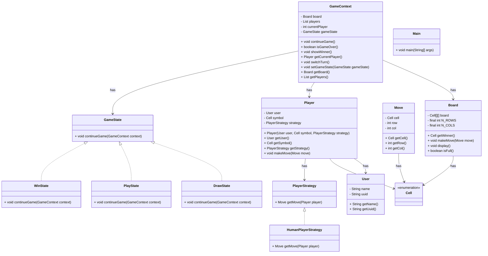

# Class Diagram

```mermaid
classDiagram
class Board {
  - Cell[][] board
  - final int N_ROWS
  - final int N_COLS
  + Cell getWinner()
  + void makeMove(Move move)
  + void display()
  + boolean isFull()
}
class Cell {
  <<enumeration>>
}
class DrawState {
  + void continueGame(GameContext context)
}
class GameContext {
  - Board board
  - List<Player> players
  - int currentPlayer
  - GameState gameState
  + void continueGame()
  + boolean isGameOver()
  + void showWinner()
  + Player getCurrentPlayer()
  + void switchTurn()
  + void setGameState(GameState gameState)
  + Board getBoard()
  + List<Player> getPlayers()
}
class GameState {
  + void continueGame(GameContext context)
}
class HumanPlayerStrategy {
  + Move getMove(Player player)
}
class Main {
  + void main(String[] args)
}
class Move {
  - Cell cell
  - int row
  - int col
  + Cell getCell()
  + int getRow()
  + int getCol()
}
class PlayState {
  + void continueGame(GameContext context)
}
class Player {
  - User user
  - Cell symbol
  - PlayerStrategy strategy
  + Player(User user, Cell symbol, PlayerStrategy strategy)
  + User getUser()
  + Cell getSymbol()
  + PlayerStrategy getStrategy()
  + void makeMove(Move move)
}
class PlayerStrategy {
  + Move getMove(Player player)
}
class User {
  - String name
  - String uuid
  + String getName()
  + String getUuid()
}
class WinState {
  + void continueGame(GameContext context)
}
GameState <|.. DrawState
PlayerStrategy <|.. HumanPlayerStrategy
GameState <|.. PlayState
GameState <|.. WinState
Board --> Cell : has
GameContext --> Board : has
GameContext --> Player : has
GameContext --> GameState : has
Move --> Cell : has
Player --> User : has
Player --> Cell : has
Player --> PlayerStrategy : has
```